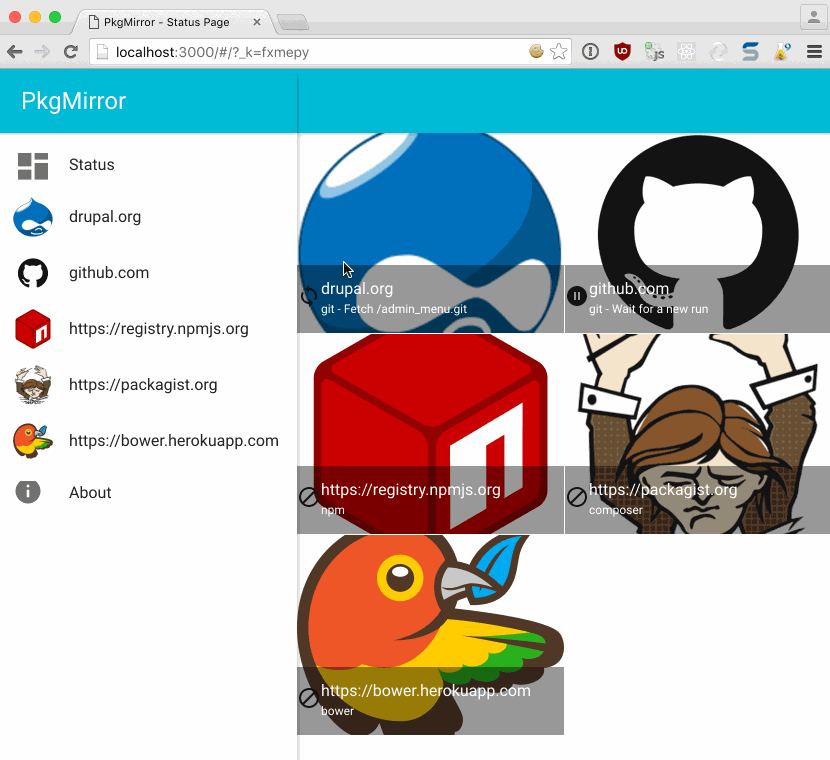

Pkg Mirrors
===========

This project aims to provides mirroring features for:
 - composer: a php package manager.
 - git: clone mirror and sync repo repository.
 - npm: a NodeJS package manager.
 - bower: a front-end package manager. 

*Please note*, if you only need to proxy packagist, please consider [Toran Proxy](https://toranproxy.com/) 
as a strong alternative. 

Documentations
--------------

### User guide

 * [Installation](docs/installation.md)
 * [Maintenance](docs/maintenance.md)
 * [Usage](docs/usage.md)

### Internals

 * [Composer](docs/composer.md)
 * [Git](docs/git.md)
 * [Npm](docs/npm.md)
 * [Bower](docs/bower.md)
 * [Static](docs/static.md)
 
GUI
---

